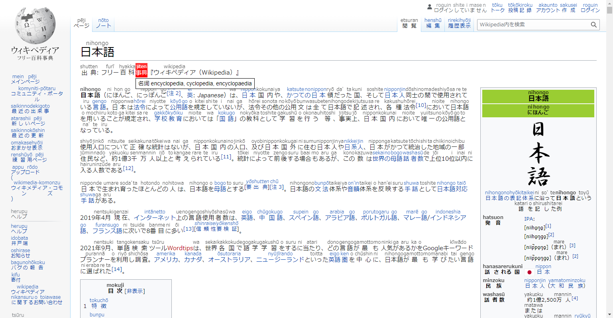

# Auto Furigana Chrome Extension

Auto insert romaji to Japanese.

[Add to Chrome](https://chrome.google.com/webstore/detail/auto-furigana/aopnnccplbmphndiljkpkcnnihfdfnpm)

## Libraries used

[kuromoji.js](https://github.com/takuyaa/kuromoji.js) - Japanese word segmentation

[japanese.js](https://github.com/hakatashi/japanese.js) - Kana to romaji
